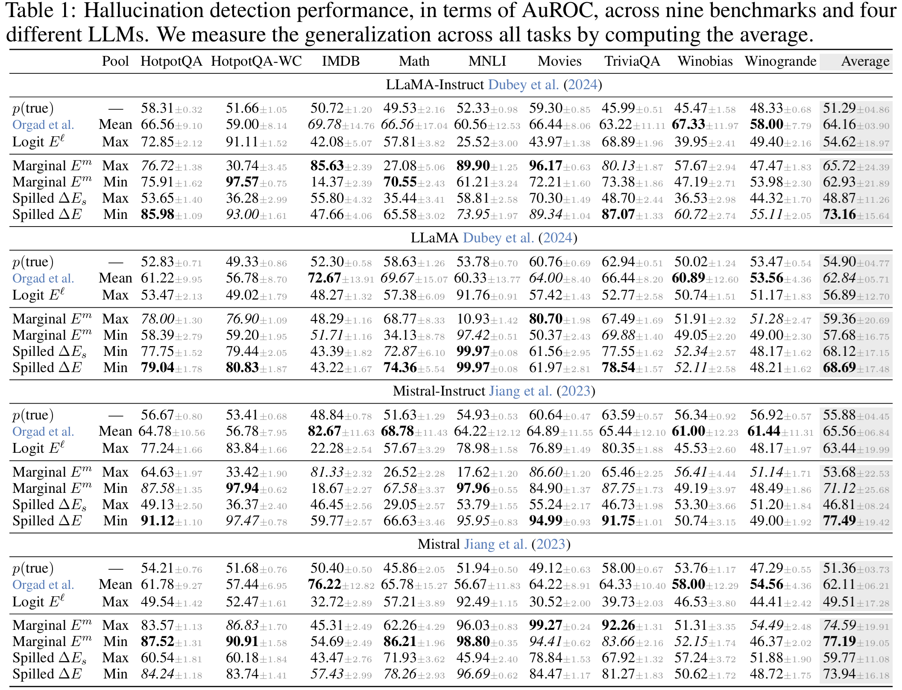

<div align="center">

# Spilled Energy in Large Language Models

### [Adrian Robert Minut](https://github.com/adrianrob1), [Hazem Dewidar](https://github.com/THESHADOW2030), [Iacopo Masi](https://iacopomasi.github.io/)

[](https://opensource.org/licenses/Apache-2.0)
[](https://iclr.cc/virtual/2026/poster/10010667)
[](https://arxiv.org/abs/2602.18671)


</div>

This repository implements **Spilled Energy**, a method for detecting hallucinations in Large Language Models (LLMs) by analyzing the probability distribution (energy) of generated tokens.

We reinterpret the final softmax classifier over the vocabulary of Large Language Models (LLM) as an Energy-based Model (EBM), allowing us to decompose the sequence probability chain into multiple interacting EBMs. This approach offers a principled way to measure where "energy spills" during decoding.


## 📚 Documentation

We have detailed documentation available in the `documentation/` directory:

- **[Introduction](documentation/introduction.md)**: Conceptual overview of Energy, Spilled Energy, and Hallucination Detection.
- **[Installation](documentation/installation.md)**: Setup guide, prerequisites, and environment configuration.
- **[Usage Guide](documentation/usage.md)**: Step-by-step instructions for generating answers and computing energy metrics.
- **[API Reference](documentation/api_reference.md)**: Detailed documentation for the library's modules and functions.
- **[Scripts](documentation/scripts.md)**: Guide to using the provided testing and benchmarking example scripts.

## 🚀 Quick Start

### Installation
```bash
git clone https://github.com/OmnAI-Lab/spilled-energy.git
cd spilled-energy
uv sync
source .venv/bin/activate
```
*See [Installation Guide](documentation/installation.md) for details.*

### Usage Example
```python
from spilled_energy.generation import generate_answer
# ... load model ...
output = generate_answer(prompt="Q: ...", model=model, tokenizer=tokenizer)
# ... compute energy ...
```
*See [Usage Guide](documentation/usage.md) for a full example.*

## 📂 Library Overview

The core logic is located in `src/spilled_energy`:
*   **`generation.py`**: Handles LLM generation and retrieves logits/scores.
*   **`extraction.py`**: Extracts the exact short answer from a long-form generation.
*   **`energy.py`**: Computes energy metrics (Spilled Energy/Delta, Energy, E_margin).

## 📓 Notebooks

The `notebooks/` directory contains interactive examples:
*   `measure_exact_answer.ipynb`: A step-by-step demonstration for a single sample.
*   `benchmark_methods.ipynb`: A full benchmarking suite example.

## Citation

```bibtex
@inproceedings{
  minut2026spilled,
  title={Spilled Energy in Large Language Models},
  author={Minut, Adrian Robert and Dewidar, Hazem and Masi, Iacopo},
  booktitle={International Conference on Learning Representations},
  year={2026}
}
```

## Main Results



## Abstract
We reinterpret the final Large Language Model (LLM) softmax classifier as an Energy-Based Model (EBM), decomposing the sequence-to-sequence probability chain into multiple interacting EBMs at inference. This principled approach allows us to track "energy spills" during decoding, which we empirically show correlate with factual errors, biases, and failures.  Similar to Orgad et al. (2025), our method localizes the exact answer token and subsequently tests for hallucinations. Crucially, however, we achieve this without requiring trained probe classifiers or activation ablations. Instead, we introduce two completely training-free metrics derived directly from output logits: **spilled energy**, which captures the discrepancy between energy values across consecutive generation steps that should theoretically match, and **marginalized energy**, which is measurable at a single step. Evaluated on nine benchmarks across state-of-the-art LLMs (including LLaMA, Mistral, and Gemma) and on synthetic algebraic operations (Qwen3), our approach demonstrates robust, competitive hallucination detection and cross-task generalization. Notably, these results hold for both pretrained and instruction-tuned variants without introducing any training overhead.

## Disclaimer

For the experiment results on real-world datasets in the "Spilled Energy in Large Language Models" paper, we used the code from [LLMsKnow](https://github.com/technion-cs-nlp/LLMsKnow) by Orgad et al.
